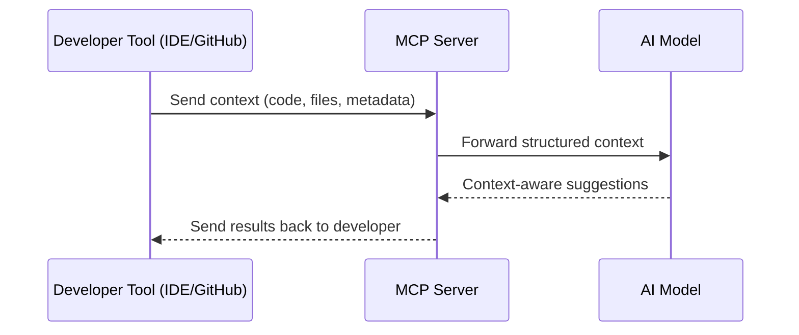

# Coaching for DevOps - Week 1

## Intro to DevOps & Branching Strategy

### Agenda

- Recap: Introduction to DevOps
- Case Study: Crowdstrike
- Case Study: Heroku Outage June 2025
- Demo: GitHub MCP Server
- Recap: Git Branching Strategies
- Exercise: Protect your branch!

---

## Introduction to DevOps

### What is DevOps?

> DevOps is the combination of cultural philosophies, practices, and tools that increases an organization's ability to deliver applications and services at high velocity.


### Stages of DevOps

| Stage        | Description                                         | Common Tools                            |
| ------------ | --------------------------------------------------- | --------------------------------------- |
| **Planning** | Define goals, requirements, and roadmap.            | Jira, Trello, Azure Boards              |
| **Coding**   | Write application code and configuration files.     | VS Code, IntelliJ IDEA, Git             |
| **Build**    | Compile and package the application for deployment. | Maven, Gradle, npm, Webpack             |
| **Test**     | Validate functionality, performance, and security.  | JUnit, Selenium, Cypress, Postman       |
| **Release**  | Approve and prepare a version for deployment.       | GitHub Actions, Jenkins, GitLab CI/CD   |
| **Deploy**   | Push the application to target environments.        | ArgoCD, Spinnaker, AWS CodeDeploy       |
| **Operate**  | Run and maintain the application in production.     | Kubernetes, Docker, AWS ECS, Azure AKS  |
| **Monitor**  | Track performance, uptime, and issues.              | Prometheus, Grafana, Datadog, New Relic |

### Benefits of DevOps

- **Rapid Delivery:** More frequent releases and faster time-to-market.
- **Reliability:** Stable environments through integration testing and continuous monitoring.
- **Scale:** Efficient infrastructure and development process management.
- **Improved Collaboration:** Code review as part of CI/CD workflow.
- **Security:** Integrates security throughout the lifecycle (DevSecOps).

---

## Case Study: CrowdStrike Incident - The Largest IT Outage in History

### What Happened
On July 19, 2024, CrowdStrike released a faulty configuration update (Channel File 291) that caused widespread crashes of Windows systems running their Falcon security software, resulting in the largest IT outage in history.

### Timeline of Events

**July 19, 2024:**
- **04:09 UTC** - CrowdStrike released problematic sensor configuration update
- **05:27 UTC** - CrowdStrike identified issue and reverted changes (too late)
- **06:48 UTC** - Azure and Google Cloud platforms reported widespread system crashes

**Recovery Period:**
- **July 19-22** - Manual remediation required (deleting faulty .sys files)
- **July 29** - 99% of affected systems back online

### Impact Scale
- **8.5 million devices** affected globally
- **5,078 flights** canceled (4.6% of scheduled flights)
- **$5+ billion** in estimated losses
- **$1.5 billion** in insurance payouts
- Disrupted airlines, healthcare, financial services, and critical infrastructure

### Technical Details
- **Affected Systems:** Windows 10/11 running CrowdStrike Falcon software
- **Unaffected:** macOS and Linux systems
- **Cause:** Logic error in configuration file → Out-of-bounds memory read due to mismatch in expected vs actual input fields (21 fields provided vs 20 expected)

### Aftermath and Response

**Company Response:**
- **July 24, 2024** - CrowdStrike published Post-Incident Review
- **August 6, 2024** - Published Root Cause Analysis with mitigation steps

**Legal Consequences:**
- **October 2024** - Delta Air Lines filed $500 million lawsuit alleging gross negligence and breach of contract

**Industry Impact:**
- Called the "largest IT outage in history" by cybersecurity experts
- Highlighted risks of single-vendor dependency in critical infrastructure
- Prompted industry-wide discussions about software testing and deployment practices

### Root Cause

1. **Input Mismatch:** Validator expected 20 fields; update provided 21.
2. **Testing Gaps:** Unit tests covered only happy paths; manual tests lacked invalid input coverage.
3. **Lack of Staggered Rollouts:** Deployed globally without phased rollout.
4. **Kernel-Level Risks:** Kernel-mode errors directly impacted system stability.

### Improvements by DevOps Stage

| Stage        | Improvement Suggestions                                                                                                             |
| ------------ | ----------------------------------------------------------------------------------------------------------------------------------- |
| **Planning** | Include rollback and phased rollout strategy in change management. Perform detailed risk assessments for kernel-level changes.      |
| **Coding**   | Apply stricter input validation and defensive coding. Conduct peer reviews focusing on configuration logic.                         |
| **Build**    | Automate static checks for configuration file integrity in the build pipeline.                                                      |
| **Test**     | Add edge case, invalid input, and backward compatibility testing. Include automated regression testing for kernel-level components. |
| **Release**  | Use gated releases with automated verification steps before approval.                                                               |
| **Deploy**   | Implement canary or blue-green deployments. First deploy to staging with production-like load testing.                              |
| **Operate**  | Introduce feature flags to quickly disable faulty updates. Maintain rapid rollback playbooks.                                       |
| **Monitor**  | Set up real-time monitoring for crash spikes post-deployment. Trigger automated rollback when thresholds are breached.              |

### Other Public Postmortem Reports for Learning

- [danluu/post-mortems](https://github.com/danluu/post-mortems)
- [snakescott/awesome-tech-postmortems](https://github.com/snakescott/awesome-tech-postmortems)
- [jimmyl02/awesome-postmortems](https://github.com/jimmyl02/awesome-postmortems)

---

## Case Study: Heroku Outage - June 10, 2025

### What Happened
On June 10, 2025, Heroku customers began experiencing a widespread service disruption starting at 6:00 UTC, creating up to 24 hours of downtime for many customers. This issue was caused by an unintended system update across their production infrastructure, demonstrating how automated processes can become a single point of failure.

### Timeline of Events

**June 10, 2025:**
- **06:00 UTC** - Heroku customers began experiencing service disruption
- **06:03 UTC** - Heroku acknowledged the incident on its status page, stating "Beginning at 06:03 UTC, Heroku is having intermittent outages which are currently being investigated"
- **21:48 UTC** - Heroku's status page stated they had resolved issues with dashboard.heroku.com and the site was accessible to customers

**Recovery Period:**
- **June 10-11** - Manual intervention required to restart affected dynos
- Services gradually restored over multiple days

### Impact Scale
- **Global outage** affecting thousands of businesses worldwide
- SolarWinds reported "incident with log delivery from Heroku to SolarWinds Observability SaaS due to an ongoing Heroku incident"
- Developers locked out of dashboards and CLI tools
- Many applications became completely inoperable
- Communication during the incident did not meet their standards, leaving many users unable to access accurate status updates

### Technical Details
- **Root Cause:** Unexpected weaknesses in infrastructure with lack of sufficient immutability controls that allowed an automated process to make unplanned changes to production environment
- **Affected Services:** Authentication systems, deployment pipelines, Heroku Connect, dashboard access
- **Communication Breakdown:** Status page being impacted by the incident itself
- **Recovery Method:** Dynos exhibiting connectivity issues could be replaced by stopping each dyno in the app's formation using Heroku CLI

### Heroku's Response and Lessons Learned

**Immediate Actions:**
- Disabled the automated upgrade service during the incident (June 10), with permanent controls coming early next week

**Long-term Improvements:**
1. **Ensuring Immutable Infrastructure:** The root cause was an unexpected change to the running environment. Permanent controls implemented to prevent automated upgrades from affecting production

2. **Guaranteeing Communication Channels:** Building backup communication channels that are fully independent to ensure timely and transparent updates, even in worst-case scenarios

3. **Accelerating Investigation and Recovery:** Overhauling incident response tooling and processes, building new tools to help engineers diagnose issues faster and run queries across entire fleet at scale

### Industry Impact and Pattern of Outages

This incident was part of a concerning pattern of reliability issues:

**Recent Heroku Outages:**
- **June 10, 2025:** 15-hour disruption preventing developers from accessing platform dashboard, utilizing CLI tools, and rendering deployed applications completely inoperable
- **June 18, 2025:** 8 hours and 30 minutes of issues with "dyno formations and autoscaling"
- **July 16, 2025:** 3 hours and 35 minutes of "data.heroku.com Dashboard degradation" coinciding with "Performance Degradation for Common Runtime in EU Region"

**Developer Community Response:**
- The growing concern over Heroku's reliability, compounded by the discontinuation of its free tier in late 2022 and escalating costs for paid plans, has accelerated the widespread search for more stable, transparent, and competitively priced PaaS solutions
- Many teams are migrating to alternatives like Northflank, Railway, and other PaaS providers

### DevOps Lessons from Heroku Outage

| Stage        | Lessons Learned                                                                                                                    |
| ------------ | ---------------------------------------------------------------------------------------------------------------------------------- |
| **Planning** | Need for comprehensive disaster recovery plans and independent communication channels during outages.                               |
| **Coding**   | Implement immutability controls and prevent automated systems from making unplanned production changes.                            |
| **Build**    | Ensure build processes have proper validation before affecting production infrastructure.                                           |
| **Test**     | Test automated upgrade processes in staging environments that mirror production complexity.                                        |
| **Release**  | Implement gradual rollouts for infrastructure changes, not just application deployments.                                          |
| **Deploy**   | Have immediate rollback capabilities for infrastructure changes and automated processes.                                           |
| **Operate**  | Maintain independent operational tooling that doesn't depend on the primary platform being functional.                            |
| **Monitor**  | Implement external monitoring and alerting systems that can detect issues even when primary systems are down.                     |

### Comparison: CrowdStrike vs Heroku

| Aspect              | CrowdStrike (July 2024)                    | Heroku (June 2025)                           |
| ------------------- | ------------------------------------------- | --------------------------------------------- |
| **Root Cause**      | Configuration file validation error         | Automated infrastructure update gone wrong    |
| **Duration**        | ~18 hours for most systems                  | Up to 24 hours                               |
| **Scope**           | 8.5 million Windows devices globally       | Thousands of businesses using Heroku PaaS    |
| **Recovery Method** | Manual file deletion and system restart    | Manual dyno restart via CLI                  |
| **Communication**   | Regular updates via status pages           | Status page also affected by outage          |
| **Industry Impact** | Largest IT outage in history               | Accelerated PaaS provider migration          |

Both incidents highlight the critical importance of:
- **Robust testing** of automated systems
- **Gradual deployment** strategies
- **Independent communication** channels during outages
- **Comprehensive rollback** procedures
- **Monitoring and alerting** systems that don't depend on the primary infrastructure

---

## What is MCP?

The **Model Context Protocol (MCP)** is a protocol that enables development tools like IDEs and source control systems to interact with AI models in a structured way. It provides a standardized way to send and receive contextual information so the AI can provide better, context-aware responses.


### Key points:

- Acts as a bridge between development tools and AI.
- Allows passing project files, code, and metadata directly to the model.
- Helps AI provide more accurate and relevant suggestions.

#### MCP Interaction Flow (Mermaid Diagram)



---

## Class Activity: GitHub MCP Demo

Interact with the latest GitHub MCP server via chat and let AI do the magic.

---

## Git Branching Strategies

### Common Strategies

- **GitFlow**
- **Trunk-based**
- **GitHub Flow**

#### GitFlow


#### GitHub Flow


#### Trunk-based Development


---

## GitHub Demo: Best Practices

1. Branch protection
2. Code review
3. Status checks
4. Resolve merge conflicts

**Activity:** Setup branch protection rules yourself!

---

## Docker Installation

### Installation Options

- **Docker Desktop:** [docker.com/products/docker-desktop](https://www.docker.com/products/docker-desktop/)
- **Windows (Chocolatey):**

  ```sh
  choco install docker-desktop
  ```

- **Mac (Homebrew):**

  ```sh
  brew install --cask docker
  ```

---

## Activity: Advanced Git Commands

### Git Commands Cheat Sheet

| Command        | Description                                       |
| -------------- | ------------------------------------------------- |
| `git log`      | Show commit logs                                  |
| `git diff`     | Show changes between commits                      |
| `git pull`     | Fetch and integrate with local branch             |
| `git remote`   | Manage remote URLs                                |
| `git branch`   | List/create branches                              |
| `git checkout` | Switch branches                                   |
| `git merge`    | Merge changes between branches                    |
| `git stash`    | Temporarily remove changes                        |
| `git rebase`   | Reapply commits on top of another base tip        |
| `git reset`    | Reset current branch to a specific state          |
| `git revert`   | Create a new commit to reverse changes            |
